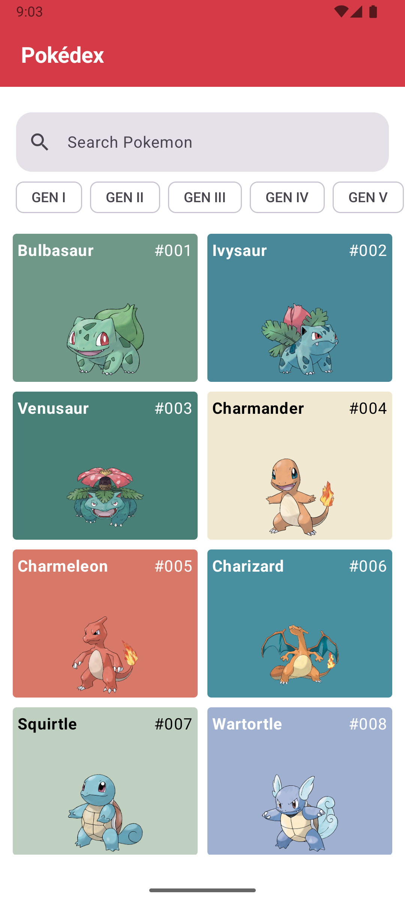
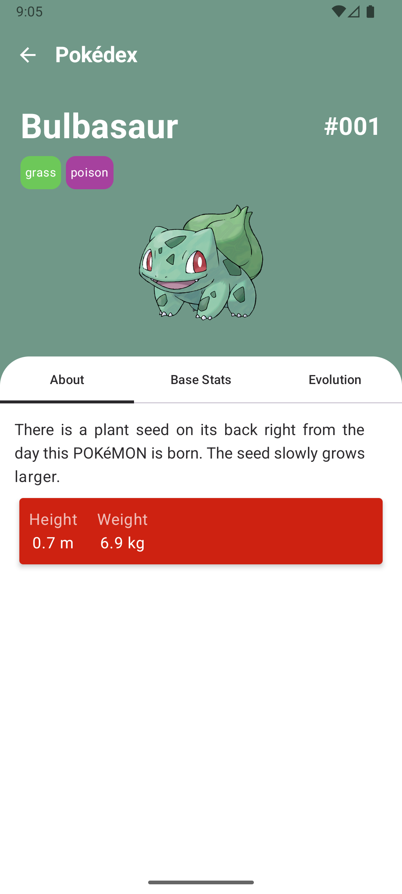
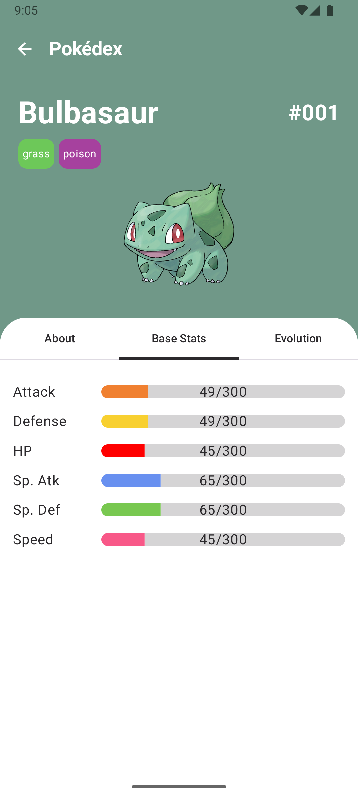
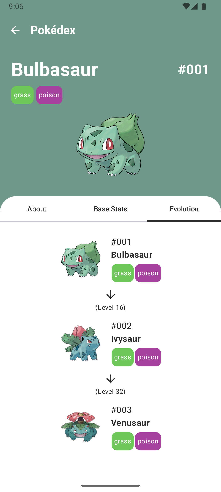

# Pokédex 🔴


**Pokédex** is a modern Android application 📱 built to demonstrate the use of *Jetpack Compose* and *Modern Android development* tools.

It loads **Pokémon** data from **PokéAPI** and displays it with a clean, responsive UI.

## Screenshots

 
  

## Key Features 🚀

- **Search & Filter**: Search for Pokémon by name and filter by generation.
- **Dynamic Theming**: UI colors adapt dynamically to the Pokémon's dominant color using the Palette library.
- **Offline Support**: Robust local caching with Room database for a seamless offline experience.
- **Pagination**: Efficiently load large lists of Pokémon using the Paging 3 library.
- **Detailed Info**: View comprehensive Pokémon details, including stats, types, and evolution chains.
- **Modern UI**: Built entirely with Jetpack Compose and Material 3.

## Built With 🛠

### Core
- [Kotlin](https://kotlinlang.org/) - Modern programming language for Android.
- [Jetpack Compose](https://developer.android.com/jetpack/compose) - Native UI toolkit.
- [Coroutines](https://kotlinlang.org/docs/coroutines-overview.html) & [Flow](https://kotlinlang.org/docs/flow.html) - For asynchronous programming.
- [Hilt](https://dagger.dev/hilt/) - Dependency injection.

### Data & Networking
- [Retrofit](https://square.github.io/retrofit/) - Type-safe HTTP client.
- [Room](https://developer.android.com/topic/libraries/architecture/room) - SQLite object mapping.
- [Paging 3](https://developer.android.com/topic/libraries/architecture/paging/v3-overview) - Paginated data loading.
- [Coil](https://coil-kt.github.io/coil/) - Image loading with Coroutines.

### Architecture & Tools
- [MVVM + Clean Architecture](https://developer.android.com/jetpack/guide) - Separates concerns for better maintainability.
- [Material 3](https://m3.material.io) - Latest design system.
- [Palette](https://developer.android.com/training/material/palette-colors) - Dynamic color extraction from images.
- [KSP](https://kotlinlang.org/docs/ksp-overview.html) - Kotlin Symbol Processing.
- [Timber](https://github.com/JakeWharton/timber) - Logging.

### Testing & Quality
- [JUnit 5](https://junit.org/junit5/) - Modern testing framework.
- [MockK](https://mockk.io/) - Mocking library for Kotlin.
- [Turbine](https://github.com/cashapp/turbine) - Testing library for Kotlin Flows.
- [Detekt](https://detekt.dev/) - Static code analysis.
- [Ktlint](https://github.com/pinterest/ktlint) - Kotlin linter.

## Architecture

The app follows the **Recommended Android Architecture** (Clean Architecture + MVVM):

- **Data Layer**: Responsible for fetching data from the PokéAPI and caching it locally in the Room database.
- **Domain Layer**: Contains business logic, entities, and use cases.
- **Presentation Layer**: UI built with Jetpack Compose, using ViewModels to manage state.


## Development 💻

### Prerequisites
- Android Studio Ladybug or newer.
- JDK 17.

### Running Tests
```bash
./gradlew test
```

### Static Analysis
```bash
./gradlew detekt
./gradlew lintKotlin
```

## Open API


This app uses the [PokéAPI](https://pokeapi.co/).

## License
```
Copyright 2026 Paulo Sabaini

This program is free software: you can redistribute it and/or modify
it under the terms of the GNU General Public License as published by
the Free Software Foundation, either version 3 of the License, or
(at your option) any later version.

This program is distributed in the hope that it will be useful,
but WITHOUT ANY WARRANTY; without even the implied warranty of
MERCHANTABILITY or FITNESS FOR A PARTICULAR PURPOSE.  See the
GNU General Public License for more details.

You should have received a copy of the GNU General Public License
along with this program.  If not, see <http://www.gnu.org/licenses/>.
```
